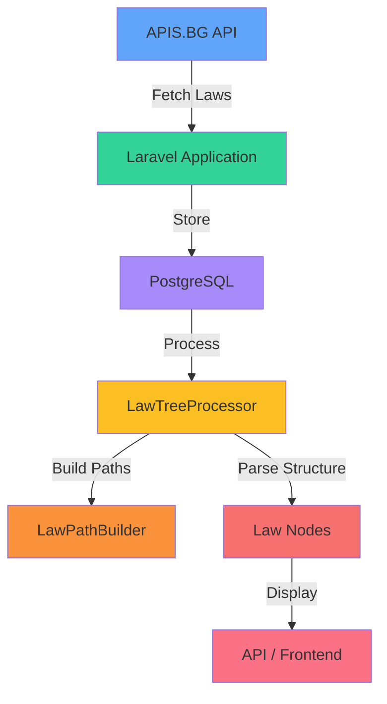

# LawDiff Assets

This directory contains visual assets for the project README and documentation.

## Required Images

### 1. Banner (`banner.png`)
**Dimensions:** 1200x300px
**Purpose:** Header banner for README

**Content Suggestions:**
- Project name "LawDiff" in large, bold text
- Subtitle "Система за анализ на законодателни промени"
- Bulgarian flag colors accent (white, green, red)
- Gavel/scales of justice icon
- Modern, professional design

**Tools to Create:**
- [Canva](https://canva.com) - Free templates
- [Figma](https://figma.com) - Design tool
- [Photopea](https://photopea.com) - Free Photoshop alternative

**Color Palette Suggestions:**
- Primary: #1e40af (Blue - representing law/stability)
- Accent: #059669 (Green - from Bulgarian flag)
- Background: #f8fafc (Light gray)
- Text: #1e293b (Dark gray)

### 2. Architecture Diagram (`architecture.png`)
**Dimensions:** 1600x1000px
**Purpose:** System architecture visualization

**Content to Include:**
```
┌─────────────────┐
│   APIS.BG API   │
└────────┬────────┘
         │
         ▼
┌─────────────────┐
│   LawFetcher    │  ← laws:fetch-contents
└────────┬────────┘
         │
         ▼
┌─────────────────┐
│   PostgreSQL    │
│   ┌──────────┐  │
│   │   laws   │  │
│   │law_nodes │  │
│   └──────────┘  │
└────────┬────────┘
         │
         ▼
┌─────────────────────────────┐
│   LawTreeProcessor          │
│   ├─ LawPathBuilder         │
│   └─ LawAmendmentParser     │
└────────┬────────────────────┘
         │
         ▼
┌─────────────────────────────┐
│   API / Livewire Frontend   │
│   Path: ЧЛ143/АЛ5А/Т3      │
└─────────────────────────────┘
```

**Tools:**
- [draw.io](https://draw.io) - Free diagramming
- [Excalidraw](https://excalidraw.com) - Hand-drawn style diagrams
- [Mermaid](https://mermaid.live) - Code-based diagrams

### 3. Cover Image (`cover.png`) - Optional
**Dimensions:** 1200x630px (Open Graph standard)
**Purpose:** Social media preview when sharing GitHub link

Same design as banner but in 1200x630 format for better social preview.

## Quick Templates

### Mermaid Diagram (Copy to mermaid.live)



## Temporary Placeholder

Until custom images are created, the README will show broken image links. You can:

1. **Remove image tags** temporarily
2. **Use shields.io badges** as placeholders
3. **Create simple text-based banners** using ASCII art

## Contributing Your Images

Once you create the images:
1. Save them in this directory (`.github/assets/`)
2. Use PNG format for best quality
3. Optimize for web (use tools like TinyPNG)
4. Commit and push to repository

The README will automatically display them once uploaded.
