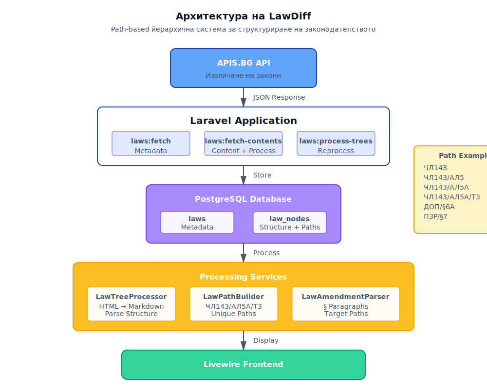

<div align="center">

# LawDiff

### Система за анализ на законодателни промени

[](https://github.com/vlados/lawdiff/actions/workflows/tests.yml)
[](LICENSE)
[](https://php.net)
[](https://laravel.com)

Уеб приложение за обработка, структуриране и анализ на български закони и законодателни изменения.

[Инсталация](#installation) • [Употреба](#usage) • [Принос](#принос)

</div>

---

## 📋 Съдържание

- [Описание](#description)
- [Възможности](#features)
- [Технологии](#technologies)
- [Архитектура](#architecture)
- [Инсталация](#installation)
- [Употреба](#usage)
- [Структура на законите](#law-structure)
- [Тестване](#testing)

## <a id="description"></a>📖 Описание

LawDiff е Laravel базирано приложение, което автоматизира процеса на обработка и анализ на българско законодателство. Системата извлича закони от APIS.BG API, структурира ги според **УКАЗ № 883** и предоставя удобен интерфейс за преглед и сравнение.

## <a id="features"></a>✨ Възможности

### Основни функции

- **Автоматично извличане на закони** от APIS.BG API
- **Структуриране на законодателството** в йерархична структура
- **Преобразуване HTML → Markdown** за по-лесна обработка
- **Path-based система** за уникална идентификация на всяка секция
- **Поддръжка на всички типове структури**:
  - Обикновени закони (чл. → ал. → т. → буква)
  - Преходни и заключителни разпоредби (§ → ал. → т. → буква)
  - Допълнителни разпоредби
- **Автоматично разпознаване на подструктури**:
  - Алинеи: (1), (2), (5а), (5б) и т.н.
  - Точки: 1., 2., 3. и т.н.
  - Букви: а), б), в) и т.н.

### Обработка на изменения

- **Временен парсинг** на законопроекти за изменение
- **Извличане на целеви пътища** за засегнатите разпоредби
- **Генериране на diff визуализации**
- **Анализ на мотиви** към изменения

## <a id="technologies"></a>🛠 Технологии

### Backend
- **Laravel 12.x** - PHP framework
- **PostgreSQL** - База данни
- **Pest** - Testing framework

### Frontend
- **Livewire 3** - Реактивни компоненти
- **Livewire Volt** - Single-file компоненти
- **Flux UI** - UI библиотека
- **Tailwind CSS 4** - Styling framework
- **Alpine.js** - JavaScript framework (включен в Livewire)

### DevOps
- **Laravel Sail** - Docker среда за разработка
- **Laravel Pint** - Code formatter
- **Laravel Boost** - MCP сървър за разработка

## <a id="architecture"></a>🏗 Архитектура

<div align="center">

<p><em>Архитектура на системата</em></p>
</div>

### Модели

#### Law (Закон)
Основният модел, съхраняващ метаданни за всеки закон:
- `unique_id` - Уникален идентификатор от APIS.BG
- `caption` - Заглавие на закона
- `content_structure` - JSON структура от API
- `content_text` - JSON текстово съдържание
- `processed_at` - Дата на обработка в law_nodes

#### LawNode (Законодателна секция)
Йерархична структура на законодателството:
- `path` - Уникален път (напр. `ЧЛ143/АЛ5А/Т3/БУКВА_В`)
- `node_type` - Тип: article, transitional_paragraph, paragraph, point, letter
- `text_markdown` - Markdown текст
- `sort_order` - Ред на показване
- `level` - Ниво на влагане
- `is_orphaned` - Дали е несвързан параграф

### Услуги (Services)

#### LawTreeProcessor
Основната услуга за обработка на закони:
- Изтрива съществуващи nodes при ре-процесиране
- Създава текстова карта от `content_text`
- Обработва йерархията от `content_structure`
- Разделя членове на алинеи, точки и букви
- Обработва както обикновени, така и преходни разпоредби

#### LawPathBuilder
Генерира уникални пътища според УКАЗ № 883:
- Обработва Кирилица с `mb_strtoupper()`
- Поддържа суфикси с букви: §6А, §6Б, АЛ5А
- Създава съкращения: ДОП, ПЗР, ПРЕХОДНИ, ЗАКЛЮЧИТЕЛНИ
- Определя типовете nodes автоматично

#### LawAmendmentParser
Парсва документи за изменение на закони:
- Извлича § параграфи с промени
- Идентифицира целеви пътища (чл. X, ал. Y, т. Z)
- Извлича мотиви към промените
- Връща структурирани данни за временна обработка

### Команди (Artisan)

```bash
# Извличане на всички закони от APIS.BG
php artisan laws:fetch --limit=100

# Извличане на съдържанието на законите
php artisan laws:fetch-contents --limit=50

# Обработка на законите в структурирани nodes
php artisan laws:process-trees --limit=50 --force

# Тестване на преходни разпоредби
php artisan law:test-transitional {law_id}

# Парсване на законопроект за изменение
php artisan law:parse-changes {file}
```

## <a id="installation"></a>🚀 Инсталация

### Изисквания
- PHP 8.4+
- Composer
- Node.js 18+
- PostgreSQL 15+
- Docker (опционално, за Sail)

### Стъпки

1. **Клониране на репозиторието**
```bash
git clone https://github.com/yourusername/lawdiff.git
cd lawdiff
```

2. **Инсталация на dependencies**
```bash
composer install
npm install
```

3. **Настройка на .env**
```bash
cp .env.example .env
php artisan key:generate
```

Конфигурирайте базата данни:
```env
DB_CONNECTION=pgsql
DB_HOST=127.0.0.1
DB_PORT=5432
DB_DATABASE=lawdiff
DB_USERNAME=your_username
DB_PASSWORD=your_password
```

4. **Миграция на базата данни**
```bash
php artisan migrate
```

5. **Компилация на frontend assets**
```bash
npm run build
# или за development:
npm run dev
```

6. **Стартиране на сървъра**
```bash
php artisan serve
```

Отворете http://localhost:8000 в браузър.

### Използване на Docker (Laravel Sail)

```bash
# Стартиране на контейнерите
./vendor/bin/sail up -d

# Миграция
./vendor/bin/sail artisan migrate

# Изпълнение на команди
./vendor/bin/sail artisan laws:fetch
```

## <a id="usage"></a>📚 Употреба

### Извличане на закони

1. **Извличане на метаданни**
```bash
php artisan laws:fetch --limit=1000
```

2. **Извличане на съдържание**
```bash
php artisan laws:fetch-contents --limit=100
```

Това автоматично извлича и обработва законите в структурирани nodes.

3. **Ре-процесиране след промени**
```bash
php artisan laws:process-trees --law-id=64 --force
```

### Работа с изменения

1. **Парсване на законопроект**
```bash
php artisan law:parse-changes /path/to/amendment.txt
```

2. **Анализ на резултатите**
Командата извлича:
- Номер на § параграф
- Съдържание на промяната
- Целеви пътища (чл., ал., т., буква)
- Мотиви

## <a id="law-structure"></a>🏛 Структура на законите

### Според УКАЗ № 883

#### Обикновени закони
```
ГЛАВА → РАЗДЕЛ → чл. → ал. → т. → буква
```

#### Преходни и заключителни разпоредби
```
ПРЕХОДНИ И ЗАКЛЮЧИТЕЛНИ РАЗПОРЕДБИ → § → ал. → т. → буква
```

#### Допълнителни разпоредби
```
ДОПЪЛНИТЕЛНИ РАЗПОРЕДБИ → § → ал. → т. → буква
```

### Примери на пътища

- `ЧЛ143` - Член 143
- `ЧЛ143/АЛ5` - Член 143, алинея 5
- `ЧЛ143/АЛ5А` - Член 143, алинея 5а (с буквен суфикс)
- `ЧЛ143/АЛ5/Т3` - Член 143, алинея 5, точка 3
- `ЧЛ143/АЛ5/Т3/БУКВА_В` - Член 143, алинея 5, точка 3, буква в)
- `ДОП/§6` - Допълнителни разпоредби, параграф 6
- `ДОП/§6А` - Допълнителни разпоредби, параграф 6а
- `ПЗР/§7` - Преходни и заключителни разпоредби, параграф 7

## <a id="testing"></a>🧪 Тестване

### Изпълнение на тестове

```bash
# Всички тестове
php artisan test

# Само Feature тестове
php artisan test --testsuite=Feature

# Само Unit тестове
php artisan test --testsuite=Unit

# Конкретен тест
php artisan test --filter=LawTreeProcessorTest

# С покритие
php artisan test --coverage
```

### Типове тестове

#### Feature Tests
- `LawTreeProcessorTest` - Обработка на закони
- `FetchLawContentsCommandTest` - Извличане на съдържание
- `ProcessLawTreesCommandTest` - Batch обработка
- `LawControllerTest` - Web контролери

#### Unit Tests
- `LawPathBuilderTest` - Генериране на пътища
- `LawAmendmentParserTest` - Парсване на изменения

### Форматиране на код

```bash
# Форматиране на променени файлове
vendor/bin/pint --dirty

# Форматиране на всички файлове
vendor/bin/pint

# Проверка без промяна
vendor/bin/pint --test
```

## 🗂 Структура на проекта

```
lawdiff/
├── app/
│   ├── Console/
│   │   └── Commands/          # Artisan команди
│   ├── Http/
│   │   ├── Controllers/       # Web контролери
│   │   └── Requests/          # Form requests
│   ├── Models/                # Eloquent модели
│   │   ├── Law.php
│   │   └── LawNode.php
│   ├── Services/              # Бизнес логика
│   │   ├── LawTreeProcessor.php
│   │   ├── LawPathBuilder.php
│   │   └── LawAmendmentParser.php
│   └── Livewire/              # Livewire компоненти
├── database/
│   ├── migrations/            # Database migrations
│   └── factories/             # Model factories
├── resources/
│   ├── css/                   # Tailwind styles
│   ├── js/                    # JavaScript
│   └── views/                 # Blade templates
├── tests/
│   ├── Feature/               # Feature тестове
│   └── Unit/                  # Unit тестове
└── routes/
    └── web.php                # Web routes
```

## 📝 Бележки за разработчици

### Code Style
Проектът използва Laravel Pint за форматиране. Винаги изпълнявайте:
```bash
vendor/bin/pint --dirty
```

### Git Workflow
```bash
# Създаване на feature branch
git checkout -b feature/my-feature

# Commit промени
git add .
git commit -m "feat: add new feature"

# Push промени
git push origin feature/my-feature
```

### Database Conventions
- Всички таблици използват `snake_case`
- Foreign keys: `{model}_id`
- Pivot tables: `{model1}_{model2}` (alphabetically)
- Timestamps: винаги включени

## 🤝 Принос

Приносите са добре дошли! Моля, следвайте тези стъпки:

1. Fork репозиторието
2. Създайте feature branch (`git checkout -b feature/amazing-feature`)
3. Commit промените (`git commit -m 'feat: add amazing feature'`)
4. Push към branch (`git push origin feature/amazing-feature`)
5. Отворете Pull Request

## 📄 Лиценз

Този проект е лицензиран под MIT License.

## 🙏 Благодарности

- **APIS.BG** за предоставения API за български закони
- **УКАЗ № 883** за стандартизираната структура на законодателството
- **Laravel** екипа за отличния framework

## 📧 Контакт

За въпроси и предложения: [dev@vladko.dev]

---

Направено с ❤️ за българското законодателство
